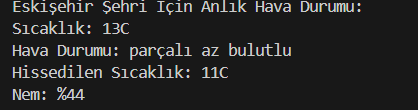
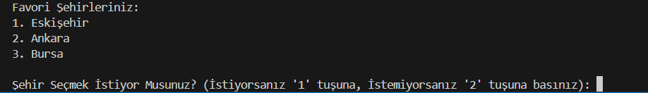

# 🌤 Hava Durumu Uygulaması
Bu proje, OpenWeather API kullanarak seçilen şehirlerin hava durumu bilgilerini gösteren bir Python uygulamasıdır. Kullanıcı, anlık hava durumu ve 5 günlük tahmin alabilir. Favorilere şehir ekleyip o şehirler üzerinden işlem yapabilir.
## 🚀 Özellikler
🌍 Anlık hava durumu bilgisi

🔮 1-5 günlük hava tahmini

📌 Favori şehirleri ekleyip yönetme

🌡️ Sıcaklık birimi seçimi (Celsius, Fahrenheit, Kelvin)

🔑 Çevresel değişkenler ile API anahtarı güvenliği

## 🛠 Kurulum
Projeyi klonlayın:  
```bash
git clone https://github.com/kullanıcı_adı/hava-durumu-uygulamasi.git
cd hava-durumu-uygulamasi

## GEREKLİ KÜTÜPHANELERİ EKLEYİN
pip install -r requirements.txt
```
## 🔑 API Anahtarı Ayarlama
OpenWeather sitesine kaydolun ve API anahtarınızı alın.


.env dosyasına aşağıdaki satırı ekleyin:

```
API_KEY=your_api_key_here
```

## 🎯 Kullanım
Uygulamayı başlatmak için aşağıdaki komutu çalıştırın:

```
python FİNAL_PROJESİ.py
```

## 🤝 Katkıda Bulunma
Katkıda bulunmak isterseniz, lütfen bir Pull Request oluşturun veya issue açın.

## 📸 Uygulama Ekran Görüntüleri

### 🌤 Anlık Hava Durumu


### ⭐ Favori Şehirler Listesi



